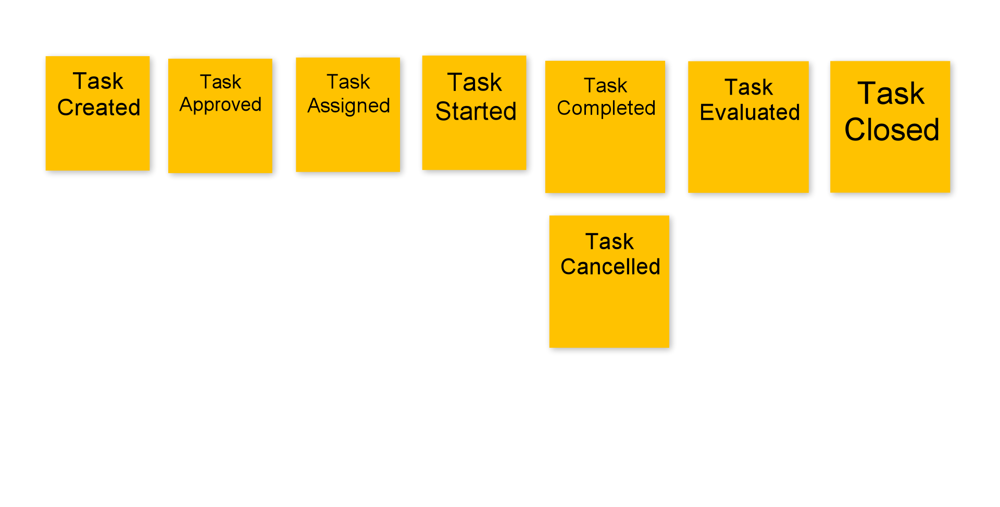
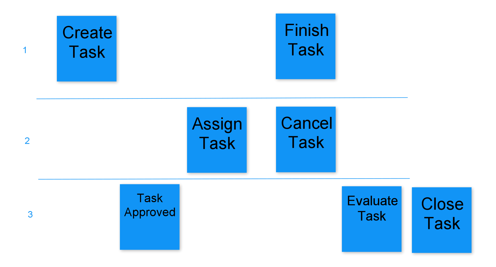

# Triple Todo

## Background

The new big shot middle manager at BigBank Incorporated got tasked with improving the efficiency of the employees.
He doesn't trust the employees what so ever. And he wants to micromanage each and every second of their time.
His vision is that there are very clear `tasks` that the resources need to complete.
They also can't just create tasks themself for anything and just work on that, he wants to approve tasks to keep everything under control.
And when the resource would indicate his task is done, then he also wants to evaluate the result.

Later on he wants to have fancy business reports and dashboards, integrations with accounting, payroll, invoicing.

The name of this grandiose project: `Zira next-gen 2020`

## This is where you come in

In the past they had some software projects that were outsources to "RandomITConsultantsInc".
The problem is, delivery was slow, and after 1,5 years and the first integrations
they started talking about things like legacy, big ball of mud, green field rewrite.

So now, there's `Triple C`, "consultants, cash and cars" comes in.
Apparently they have a magical technique called "Clean architecture" that will solve all their problems.

Also they didn't want to start with a huge analysis document, but something called an "eventstorming?".
Drudgingly some managers got dragged up into a big meeting room and some hipsters we're waiting with post it's.
We answered questions, got into discussions and they apparently found it useful enough to start development...

They we're negotiating about the things we want, we don't understand why, but they wanted to "slice" things up.
We just need the task system, it's not a piece of cake!

### Event storming result

### User story result

### Some notes from development
#### Event storming command "gaps"
While an eventstorming brings out the most important commands, some common ones, like the update of certain information might go missing as it is sometimes too obvious to mention if it doesn't have any business side-effects. This is what happened to the Update Information In Todo Item command.

#### Event storming queries
Another item that will lack in the flow are the queries, the questions you can ask your system and the state that you can return. This is usually backtracked from what is need for the next command and other information that your users need to see. It's needlessly complex to dig out all this information before hand, and is easily fleshed out while working on the api.